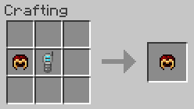

# TOPAddons

A Minecraft mod which adds mod support to The One Probe by McJty

## Currenty supports:

### Forge

- Tank display (a.t.m. just for blocks with the FluidHandler Capability)

### Forestry ([album](http://imgur.com/a/APS3S))

- Error messages for all blocks with GUIs that display them
- Internal tank display
- Breeding progress (no values) and queen display for all beehouses
- Special information displays for Moistener and Multiblock Farms
- Show fruit ripeness on leaves and whether they are pollinated (only when wearing spectacles or apiarist's hat)

### Tinkers' Construct ([album](http://imgur.com/a/F7LbA))

- Extended view of fluids inside the controller when sneaking
- Progress for casting table/basin

### Blood Magic: Alchemical Wizardry ([album](http://imgur.com/a/t9aNg))

- Altar tier and Essence contents (requires divination/seer sigil*)
- Altar crafting progress (requires seer sigil)
- Incense altar tranquility and sacrifice bonus (requires divination/seer sigil)
- Filter configuration for routing nodes (side-sensitive)

### Storage Drawers ([album](http://imgur.com/lXSgOm5))

- More detailed information on stored item stacks
- Stack capacity

*Also works in sigil of holding

## Probing Helmets
Craft modded helmets with a probe to get their *probing* variants, currently works with:

- Botania: Manasteel, Elementium, Manaweave and Terrasteel helmets(non-revealing versions)
- Forestry: Apiarist helmet and Spectacles
- Blood Magic: Living and Sentient helmets

Uncraft by putting the helmet back in the crafting grid with nothing else.
